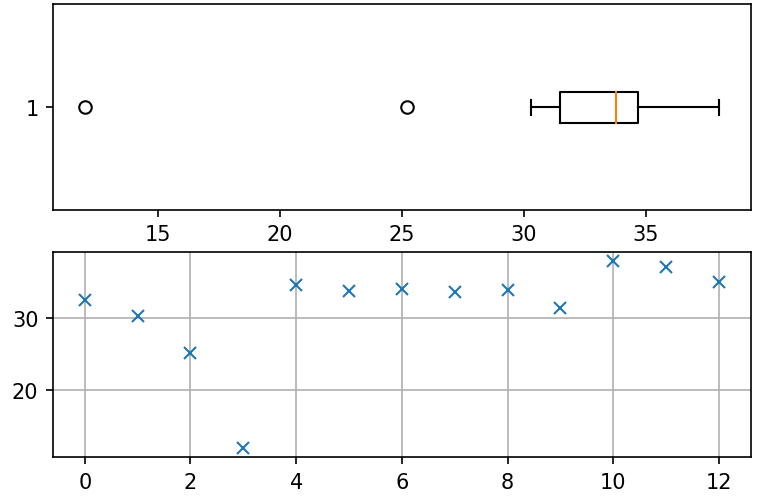

# Detecção/Remoção de Outliers com Python: Casos Univariado e Multivariado

**Outlier:** é aquele valor muito discrepante em relação aos demais valores para uma certa variável. <u>É um valor atípico</u>. 

*Ele interfere no cálculo das estatísticas, por isso, em muitas situações deve ser removido. Em outras ele pode ser mantido para ser estudado separadamente.*

**Fontes de outliers:** Pode ser devido a:
* (Caso artificial): erros de registro do(s) dado(s);

    *Ex: a pessoa anotou a temperatura do paciente como sendo 73,2º quando deveria ter anotado o valor 37,2º.*

* (Caso natural): proveniente de um evento raro;

    *Ex: um dos familiares ganha na loteria aumentando muito sua renda em relação aos demais.*
    
    
    Este vídeo-tutorial está disponível no Youtube: https://youtu.be/CLN-y_4ZySw
    
    
